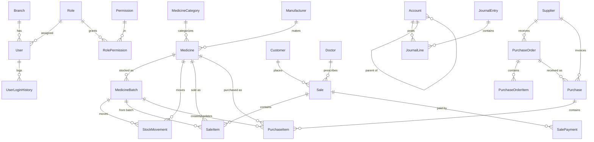

# Database Design

A normalized SQL Server schema modelled with EF Core code-first. All tables inherit
audit + soft-delete columns from `BaseEntity` (`Id`, `CreatedAtUtc`, `CreatedBy`,
`ModifiedAtUtc`, `ModifiedBy`, `IsDeleted`, `DeletedAtUtc`, `DeletedBy`). Branch-scoped
tables additionally carry `BranchId`.

## Modules & tables

### Identity & security
- **Branches** — physical stores (multi-branch root).
- **Users** — credentials, role, branch, lockout & reset fields. `Username` unique.
- **Roles**, **Permissions**, **RolePermissions** — role-based access (many-to-many).
- **UserLoginHistories** — every login attempt (success/failure).
- **ActivityLogs** — audit trail of actions (old/new values).

### Master data
- **Medicines** — catalogue SKU (generic, brand, composition, GST/HSN, MRP, prices,
  schedule type, reorder levels, barcode). Indexed on name/generic/barcode.
- **MedicineCategories**, **Manufacturers**, **Suppliers**, **Customers**,
  **Doctors**, **Employees**.

### Inventory
- **MedicineBatches** — per-batch stock (batch no., mfg/expiry dates, qty, pricing).
  This is the unit of stock decremented on sale (FIFO/FEFO) and created on purchase.
- **StockMovements** — immutable stock ledger (in/out/adjust/transfer/damage/expiry).
- **StockAdjustments / StockAdjustmentItems** — physical verification & corrections.

### Sales
- **Sales** (invoice header) → **SaleItems** (batch-linked lines) + **SalePayments**
  (split tenders). `InvoiceNumber` unique; indexed on date.

### Purchases
- **PurchaseOrders / PurchaseOrderItems** — ordering.
- **Purchases** (GRN/invoice) → **PurchaseItems** — receiving with batch & expiry.

### Accounting
- **Accounts** — chart of accounts (asset/liability/equity/income/expense).
- **JournalEntries → JournalLines** — double-entry vouchers (general ledger).

### System
- **CompanyProfiles** — company/store settings for invoices & reports.
- **Notifications** — low-stock/expiry/payment/backup alerts.

## Relationship overview (ER)

## Conventions & constraints

- Monetary/quantity `decimal` columns default to `precision(18,2)`.
- Header→detail relationships (Sale→SaleItems, Purchase→PurchaseItems, PurchaseOrder→Items,
  Sale→Payments) use **cascade delete**; all reference FKs (medicine, batch, customer,
  supplier, doctor) use **restrict** to avoid multiple cascade paths and preserve history.
- Unique indexes: `Branch.Code`, `User.Username`, `Role.Name`, `Permission.Key`,
  `(RoleId, PermissionId)`, `Sale.InvoiceNumber`, `Purchase.InvoiceNumber`,
  `PurchaseOrder.OrderNumber`.
- Performance indexes on medicine name/generic/barcode, batch (medicine+batch+branch),
  expiry date, and invoice dates — supporting the <100 ms search goal.

## Seed data

On first run `DbSeeder` applies migrations and inserts: all permissions, a `SuperAdmin`
role (with every permission) plus baseline roles, a Head Office branch, the `admin` user,
a company profile, a standard chart of accounts, and two sample medicines.
